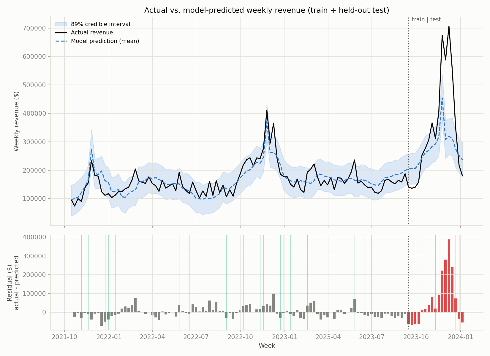
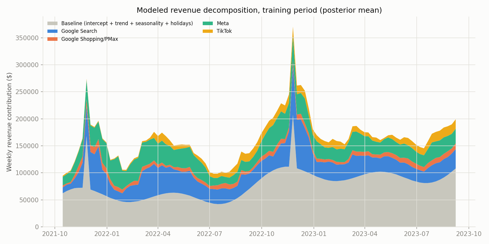
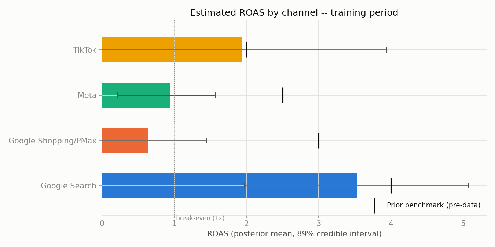
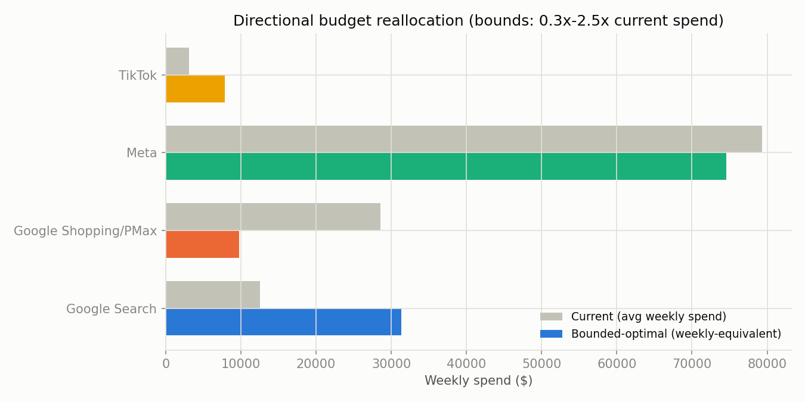

# MMM-lite

A Bayesian Marketing Mix Model (MMM) built with [PyMC-Marketing](https://www.pymc-marketing.io/) on **real** multi-brand eCommerce spend and revenue data — not a synthetic demo.

Given weekly ad spend across Google Search, Google Shopping/PMax, Meta, and TikTok, the model estimates each channel's contribution to revenue, accounting for carryover effects (adstock) and diminishing returns (saturation), and validates its predictions on a genuine held-out time period.

## Data source

Anderson (2024), ["Multi-Region Marketing Mix Modeling (MMM) Dataset for Several eCommerce Brands"](https://figshare.com/articles/dataset/Multi-Region_Marketing_Mix_Modeling_MMM_Dataset_for_Several_eCommerce_Brands/25314841) (Conjura, figshare) — anonymized daily spend/purchase data across 143 brand-region timeseries. This project uses a single brand/region (Food & Drink, US) with the longest, cleanest history in the export: 821 days of gap-free daily data, well-populated across all four channels.

## Method

- **Adstock**: `GeometricAdstock(l_max=8)` — up to 8 weeks of carryover per channel.
- **Saturation**: `LogisticSaturation()` — diminishing returns at high spend, with `saturation_beta` priors centered on generic paid-eCommerce ROAS benchmarks (Search 4.0x, Shopping/PMax 3.0x, Meta 2.5x, TikTok 2.0x) rather than fabricated lift-test data, since none exists for this dataset.
- **Controls**: linear trend, yearly Fourier seasonality, US federal holidays, Black Friday/Cyber Monday.
- **Fitting**: NUTS, 4 chains × 1,000 tune + 1,000 draw, on weeks 1–100 only.
- **Validation**: the final 17 weeks (~14.5%) are held out and never shown to the model during fitting, so out-of-sample accuracy is a genuine test, not an in-sample fit dressed up as one.

Full methodology, every design decision, and the reasoning behind it are documented inline in `src/`.

## Results

| Metric | In-sample (train, n=100 weeks) | Out-of-sample (test, n=17 weeks) |
|---|---|---|
| MAPE | 14.3% | 29.7% |
| R² | 0.68 | 0.33 |

The out-of-sample test window includes the single largest revenue spike in the dataset (Black Friday/Cyber Monday), which the model underpredicts — a large in-sample → out-of-sample gap here is expected, not a red flag being glossed over.

**Convergence**: max r̂ = 1.003, min ESS = 2,125 — within standard targets for every reported parameter.

**Per-channel ROAS** (training period, posterior mean, 89% credible interval):

| Channel | ROAS | 89% CI |
|---|---|---|
| Google Search | 3.53x | [1.97, 5.07] |
| Google Shopping/PMax | 0.64x | [0.00, 1.45] |
| Meta | 0.94x | [0.22, 1.57] |
| TikTok | 1.94x | [0.00, 3.94] |

Two channels land below break-even with wide intervals — flagged as a likely identifiability artifact (Search, Shopping/PMax, and Meta spend move together with overall marketing pressure, which observational data alone can't fully disentangle) rather than a literal claim that those channels are unprofitable. See **Limitations**.






## Limitations

This is uncalibrated observational MMM — read the numbers accordingly:

1. **No incrementality/lift-test calibration.** Adstock and saturation curves are only weakly identified from spend data alone; the below-break-even ROAS channels above are the direct symptom of that.
2. **Revenue is gross-of-returns.** Net of discounts, not net of refunds — true incremental revenue may be lower for high-return categories.
3. **Single brand/region.** Nothing here generalizes without refitting.
4. **Out-of-sample accuracy is materially weaker than in-sample**, driven largely by one holiday demand spike in the test window.
5. **The budget reallocation suggestion is directional only** — a hypothesis to test with a real experiment, not an instruction.

## Repository structure

```
MMM-lite/
├── data/
│   ├── conjura_mmm_data.csv           raw export (input)
│   ├── mmm_weekly_data.csv            prepared weekly data
│   ├── fitted_mmm.nc                  saved posterior trace
│   ├── metrics.json                   MAPE / R² / convergence
│   ├── roas_estimates.csv             per-channel ROAS
│   └── budget_reallocation.json       directional reallocation suggestion
├── figures/                           generated charts
└── src/
    ├── prepare_data.py                step 1: clean/assemble weekly data
    ├── fit_model.py                   step 2: fit the Bayesian MMM
    ├── evaluate.py                    step 3: out-of-sample validation, ROAS, diagnostics
    └── budget_optimizer.py            step 4: budget-reallocation suggestion
```

## Running it

```bash
pip install pymc-marketing pandas numpy arviz matplotlib holidays openpyxl

python src/prepare_data.py
python src/fit_model.py
python src/evaluate.py
python src/budget_optimizer.py
```

Each script reads/writes `data/`, in order. Re-running `fit_model.py` overwrites the saved trace — re-run `evaluate.py` and `budget_optimizer.py` afterward to keep everything in sync.
